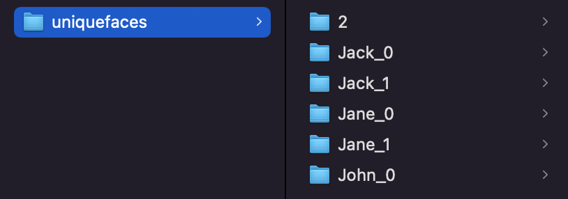

# Photo Classifier

## Overview
This program provides an easy way to classify large numbers of pictures into groups based on the people in the pictures.

## Dependencies
In order to run this program, you will need to install Python. Instructions for this installation can be found on  the Python homepage [here](https://www.python.org/downloads/). This program uses Python 3.10.9, however, later and earlier versions of Python 3 will also work fine. Once Python is installed, several modules must also be installed. These modules are:
* ```numpy```
* ```pandas```
* ```os```
* ```shutil```
* ```PIL```
* ```face_recognition``` (instructions for download can be found [here](https://pypi.org/project/face-recognition/#installation))

All the modules excluding ```face_recognition``` can be installed with a ```pip install```. Navigate to the terminal(command prompt on Windows) and paste in the following command:  
```pip install numpy pandas os shutil PIL```  
This should install all the dependencies for the program.

## Usage
To use this program, follow these instructions:
* Step 1: Download the ```code``` folder from this repository.
* Step 2: Within the ```code``` folder, there should be an ```images``` folder. Create a folder called ```new``` in this folder. This is where you will upload your photos.
* Step 3: Once all of your photos have been uploaded to the ```new``` folder, navigate to the terminal and into the ```code``` folder using the ```cd``` command.
* Step 4: Start a Python environment by entering ```python3``` into the terminal. Do NOT close this environment until you have finished Step 9.
* Step 5: Copy and paste these following commands, in order, into the environment:  
    * ```from main import *```
    * ```init()```
    * ```saveUniqueFaces(0)```  
    Note: The last line may take a long time to execute, depending on how many photos you have uploaded. Each photo takes around 1.5-3 seconds to process(depending on the computing power of your machine), so a set of 1000 photos, for example, may take around 25-50 minutes to process.
* Step 6: In your computer's file navigator, navigate to the ```uniquefaces``` folder within ```images```. This folder should now contain several numbered folders with pictures of people's faces in them. Each folder contains several files of the same person's face. You will need to rename each folder to the name of the person whose pictures are contained. Here is an example of what the folder should look like after doing this:
    
Note: In order for the folder to be included, it *must* be renamed with the format \<name>_\<uniqueid>. Even if there is only one folder for a person, such as John in the above picture, there must be an underscore and an id(can be any string of characters) after the name. If this is not followed, the folder will be ignored in the next step. Any folders you wish to not use in the classification step, for example, a folder with pictures that are not faces or people not intended to be in any pictures, do not have to be renamed and can be kept as the number the program has assigned them. For example:  In this example, the folder named ```2``` is a folder with a picture of a person present in the background of some photos. These folders do not need to be deleted.
* Step 7: Back in the Python environment created in Step 4, execute the following line of code: ```findFacesFolder()```   
Note: This line will take a similar amount of time to run as the last line of code in Step 5, give or take a few minutes. Also, do not close the environment.
* Step 8: This step is where you will create your list of "groups". Essentially, the list of groups is a list of any groups, such as families, that are sets of people. These groups will be stored in a csv file called ```groups.csv```. The csv file should be in the following format:
    ```
    groupname,names
    Doe, John|Jane|Johnny
    Waterson, Jack|Jill
    ```
    The first row should be the same in your file as it is here, but the rest should be whatever groups you want to include. The first column is the name of the group(e.g. family name, team name), and the second column is the list of people in the group, ```separated|by|pipes|like|this```. A person can be in more than one group. The names in the ```names``` column should match the names you gave to the folders in Step 6. For example, if one of your folders is ```John_0```, then the name John should be used in ```groups.csv```.
* Step 9: Finally, in the same python environment you created in Step 4, run the command: ```createGroupFolders()```. You can now close the environment by running the command ```quit()```.
* Step 10: You are now done! In the ```images/grouped``` folder, there should be a folder for each of the groups in the csv file. Within each of these folders, there are a bunch of images that contain any one person in the group. There is also a subfolder in each group folder called ```only``` that contains only pictures that have no one other than the people in the group. There will also be a ```misc``` folder that contains pictures where none of the people in the ```csv``` file were found. These pictures may genuinely have no faces, but more likely, they contain side profiles or distorted faces that the program cannot identify.

## Details
The program's main dependency is the ```face_recognition``` python library, which is built on ```dlib```. It first uses a subset of the photo set given to create a "training" set of data by classifying the images into groups of close-enough faces. Then, after the user labels the groups, it takes an average of the faces in each group, and uses a nearest neighbor classifier on the original photo set to find the faces in each picture. Using ```face_recognition```'s ```face_encodings()``` method, pictures of people's faces can be encoded into points in 128-dimensional space, allowing the program to compare two faces by finding the distance between two points.

## Results
Upon testing, the program is able to classify around 60 to 70 percent of the photo set correctly. The rest are usually pictures that contain side profiles or distorted faces which cannot be identified correctly. However, this number can vary greatly depending on the photo set.